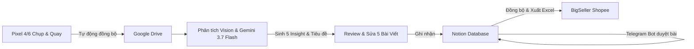

# TÀI LIỆU BÀN GIAO TOÀN DIỆN DỰ ÁN MCP SHOPEE KHẢI HOÀN (HANDOFF DOCUMENT)

> **Dành cho Codex / AI Assistant tiếp nối phát triển hệ thống**  
> **Phiên bản hiện tại:** `v2.2.46`  
> **Thư mục làm việc chính thức:** `D:\Project Anti\MCP Shopee`  
> **Repository GitHub:** `https://github.com/datdtpl-maker/MCP-Shopee_Khai-Hoan.git`

---

## 📌 1. TỔNG QUAN HỆ THỐNG & MỤC TIÊU DỰ ÁN

**MCP Shopee Khải Hoàn** là một ứng dụng Desktop & Web App toàn diện được thiết kế chuyên biệt cho hệ thống Dược Mỹ Phẩm **Khai Hoàn Skincare & Khai Hoàn Derma**. Hệ thống kết nối chuỗi quy trình bán hàng tự động khép kín:



### Các trục tính năng cốt lõi:
1. **Chụp & Quay Pixel Drive Capture**: Tự động hóa kết nối điện thoại Google Pixel qua ADB, chụp ảnh/quay video và tự động kéo về lưu trữ phân loại trên Google Drive.
2. **AI Vision & Gemini 3.7 Flash Copywriting**: Đọc nhãn mác sản phẩm, trích xuất thông tin, tạo 5 góc bán hàng (Insight), viết trọn vẹn 5 bài viết chuẩn Shopee và cho phép người dùng xem/chỉnh sửa trực tiếp trước khi lưu.
3. **Notion & Telegram Workflow**: Lưu trữ phân cấp Sản phẩm (Parent) ➔ 5 Insight (Children), quản lý trạng thái duyệt bài qua Telegram Bot.
4. **Đồng bộ BigSeller Shopee**: Trích xuất dữ liệu bài viết đã duyệt trên Notion, đóng gói thành file Excel template chuẩn BigSeller theo đúng từng sản phẩm và lưu trữ trực tiếp vào thư mục Google Drive của sản phẩm đó.

---

## 📂 2. CẤU TRÚC THƯ MỤC & FILE CỐT LÕI

```text
D:\Project Anti\MCP Shopee\
├── web_app.py                     # [CORE] Backend Flask + Giao diện Web MD3 + Toàn bộ API Endpoints
├── pipeline.py                    # Module điều khiển ADB cho Google Pixel (Chụp/Quay/Sync)
├── config.json                    # Cấu hình cài đặt cục bộ của ứng dụng desktop
├── .env                           # File biến môi trường (Notion, Telegram, Gemini API Key)
├── handoff.md                     # Tài liệu bàn giao chi tiết cho Codex
├── .github/
│   └── workflows/
│       └── build.yml              # GitHub Actions tự động build PyInstaller khi push Tag
└── shopee_sync/
    ├── .env                       # Cấu hình env độc lập của module Shopee Sync
    ├── src/
    │   ├── notion_sync.py         # Xử lý tương tác Notion API, tạo post, xuất Excel BigSeller
    │   ├── telegram_bot.py        # Bot Telegram duyệt bài, gửi thông báo
    │   ├── convert_zicum.py       # Xử lý chuỗi, tìm kiếm folder Google Drive, ánh xạ Insight
    │   └── ai_generator.py        # Module AI bổ trợ kiểm duyệt bài viết
    └── template_excel/
        └── template_shopee.xlsx   # Mẫu file Excel chuẩn của BigSeller để clone dữ liệu
```

---

## 🧠 3. LOGIC HOẠT ĐỘNG & CÁC LUỒNG XỬ LÝ CHÍNH

### A. Luồng Quản Lý Cấu Hình (Notion, Telegram, Gemini API Key)
* **File lưu trữ**: `D:\Project Anti\MCP Shopee\shopee_sync\.env` và `D:\Project Anti\MCP Shopee\.env`.
* **Bộ parser cấu hình (`parseConfigFileText` trong `web_app.py`)**:
  * Hỗ trợ đọc cả file `.env` chuẩn (`KEY=VALUE`) và file Notepad++ tiếng Việt (`đồng bộ shopee.txt`).
  * Tự động nhận diện các khóa: `NOTION_TOKEN`, `NOTION_DATABASE_ID`, `TELEGRAM_BOT_TOKEN`, `MANAGER_CHAT_ID`, `GEMINI_API_KEY`, `DRIVE_ROOT_FOLDER_ID`.
* **Cơ chế xác thực Gemini API Key (`/api/shopee/config/test-gemini`)**:
  * Gọi Google API `ListModels` (`https://generativelanguage.googleapis.com/v1beta/models?key=...`) để xác thực tính hợp lệ của key.
  * Tự động lọc và kiểm tra các dòng **Gemini Flash thế hệ mới**: `gemini-3.7-flash`, `gemini-3.6-flash`, `gemini-3.5-flash`, `gemini-2.0-flash`.
  * Tuyệt đối không gọi các model Pro cũ hoặc model bị ngưng hỗ trợ như `gemini-2.5-flash` để tránh lỗi 400.

---

### B. Luồng Phân Tích Hình Ảnh & Sinh 5 Insight (`/api/analyze-product`)
1. Người dùng chọn ảnh hoặc dán link Google Drive của sản phẩm.
2. Hệ thống gọi **Gemini 3.7 Flash Vision** để quét:
   * Tên sản phẩm, giá bán, phân loại dung tích/màu sắc, biến thể, thành phần và công dụng thực tế.
3. Sinh ra danh sách **5 góc tiếp cận (Insight)** khác nhau:
   * *Góc 1: Giải quyết nhanh triệu chứng cốt lõi (Vd: Giảm sưng đỏ cấp tốc).*
   * *Góc 2: Phân tích hoạt chất / cơ chế tác động kép.*
   * *Góc 3: Cơ chế gom cồi / phục hồi không để lại thâm sẹo.*
   * *Góc 4: Thiết kế tiện lợi / trải nghiệm sử dụng hàng ngày.*
   * *Góc 5: Hướng dẫn kết hợp chu trình skincare an toàn.*
4. Hiển thị 5 dòng lên **Bảng Review Insight** để người dùng xem và chỉnh sửa từ khóa/tiêu đề.

---

### C. Luồng Xem & Chỉnh Sửa Chi Tiết 5 Bài Viết AI (Modal 5 Tabs)
* **Nút kích hoạt**: `📝 Xem & Chỉnh sửa bài viết AI` (nằm cạnh nút *Ghi nhận vào Notion*).
* **API hỗ trợ**:
  * `/api/insight/generate-all-posts`: Tự động gọi Gemini 3.7 Flash sinh đầy đủ 5 bài viết chi tiết nếu chưa sinh.
  * `/api/insight/generate-single-post`: Cho phép bấm nút `✨ Viết lại bài này bằng Gemini AI` để sinh lại riêng bài đang chọn.
* **Giao diện Modal 5 Tabs (`fullPostsModal`)**:
  * Cho phép người dùng chuyển qua lại giữa 5 tab (`[Bài #1]` đến `[Bài #5]`).
  * Người dùng có thể đọc và sửa trực tiếp từng trường:
    * `postTitle`: Tiêu đề chuẩn SEO Shopee.
    * `angle`: Góc bán hàng nổi bật.
    * `description`: Đoạn văn mô tả chân thật, giàu cảm xúc bán hàng.
    * `ingredients`: Danh sách thành phần (1 dòng / hoạt chất).
    * `benefits`: Danh sách công dụng hỗ trợ (1 dòng / công dụng).
    * `target_users`: Đối tượng sử dụng bám sát tình trạng da thực tế.
    * `usage` & `notes`: Hướng dẫn sử dụng & lưu ý an toàn y khoa.
    * `hashtags`: Bộ hashtag bán hàng thực tế.
  * Bấm `💾 Lưu thay đổi bài viết` để ghi đè vào state client (`state.insights[i].full_post`).

---

### D. Bộ Quy Tắc Prompt Copywriter Shopee (`generate_single_post_body`)
* **Vai trò AI**: Dược sĩ / Chuyên viên tư vấn da liễu Khai Hoàn Skincare & Derma.
* **Quy tắc giọng văn**:
  * ❌ Cấm câu văn máy móc: *"là giải pháp chăm sóc sức khỏe và làm đẹp vượt trội"*, *"đáp ứng nỗi đau của khách hàng ở góc bán hàng"*, *"chuẩn SEO Shopee"*.
  * ❌ Cấm mặc định câu: *"Người lớn và trẻ em từ 6 tuổi trở lên cần chăm sóc chuyên sâu"* cho mọi sản phẩm.
  * ❌ Cấm từ khẳng định y khoa chữa bệnh trên Shopee: *"đặc trị", "trị mụn", "điều trị", "dứt điểm", "chữa khỏi", "thuốc"*.
  * ✅ Dùng từ an toàn E-commerce: *"hỗ trợ giảm", "giúp làm dịu sưng đỏ", "hỗ trợ gom cồi", "chăm sóc da mụn", "giúp da thông thoáng"*.
  * ✅ Hashtags thực tế: `#{ten_san_pham_khong_dau}`, `#gelchammun`, `#gomcoimun`, `#khaihoanskincare`, `#khaihoanderma`, `#myphamchinhhang` (loại bỏ hoàn toàn `#ShopeeSEO`, `#DuocMyPham`).

---

### E. Luồng Ghi Nhận Lên Notion (`/api/review-save`)
1. Kiểm tra hoặc tạo trang **Sản phẩm cha (Parent Page)** trong Database Sản phẩm (`NOTION_DATABASE_ID`).
2. Tự động tìm kiếm hoặc liên kết với thư mục sản phẩm trên Google Drive:
   * Thư mục gốc Drive: `1XrOmOCqdZ3xfkeVaBc0Vr77Q7yRW0PxZ` (hoặc cấu hình `DRIVE_ROOT_FOLDER_ID`).
3. Lặp qua 5 Insight con:
   * Sử dụng trực tiếp `full_post` đã được người dùng chỉnh sửa trong Modal (nếu chưa mở modal thì tự động sinh).
   * Tạo trang con trong Database Insight (`88159c90-46fb-426d-b3c9-a0d79358e76c`) liên kết Relation về trang cha.
   * Tạo các block nội dung: Callout giới thiệu, Heading 2 phân mục, Bulleted list items cho thành phần, công dụng, đối tượng, lưu ý và đoạn Hashtags.
4. Tự động xuất file `insights_data.json` trực tiếp vào thư mục sản phẩm trên máy (`G:\My Drive\Hình ảnh Shopee\<Tên sản phẩm>\insights_data.json`).

---

### F. Luồng Đồng Bộ Sang BigSeller & Xuất File Excel
1. **Lọc dữ liệu chính xác**: Chỉ đồng bộ đúng 5 Insight thuộc về sản phẩm được chọn, không dính sản phẩm khác, không ghi đè dữ liệu cũ.
2. **Tự động lưu file Excel**:
   * Khi bấm **"Đồng bộ ngay"**, hệ thống sinh file `bigseller_sync_<YYYYMMDD_HHMMSS>.xlsx`.
   * Tự động copy file Excel này vào đúng thư mục của sản phẩm:  
     `G:\My Drive\Hình ảnh Shopee\<Tên sản phẩm>\bigseller_sync_<timestamp>.xlsx`.
3. **Trạng thái**:
   * Sản phẩm đang làm chuyển trạng thái: `Chờ đăng`.
   * Khi người dùng tự lấy file Excel đăng lên Shopee xong sẽ tự chuyển thành `Đã đăng`.

---

## ⚙️ 4. BẢNG BIẾN MÔI TRƯỜNG & THÔNG SỐ KỸ THUẬT

| Tên biến | Mô tả | Định dạng ví dụ |
| :--- | :--- | :--- |
| `NOTION_TOKEN` | Mã bí mật Notion Integration | `ntn_...` hoặc `secret_...` |
| `NOTION_DATABASE_ID` | Database ID quản lý Sản phẩm | `ca055a7742824b9598abde7a7686d144` |
| `TELEGRAM_BOT_TOKEN` | Token điều khiển Telegram Bot | `123456789:ABCdef...` |
| `MANAGER_CHAT_ID` | Chat ID của quản lý nhận thông báo duyệt | `6295080195` |
| `GEMINI_API_KEY` | API Key của Google Gemini AI Studio | `AIzaSy...` (hoặc `sk-...` nếu dùng OpenAI) |
| `DRIVE_ROOT_FOLDER_ID` | ID thư mục gốc `Hình ảnh Shopee` trên Google Drive | `1XrOmOCqdZ3xfkeVaBc0Vr77Q7yRW0PxZ` |

---

## 🚀 5. QUY TRÌNH NÂNG CẤP, COMMIT & BUILD APP TRÊN GITHUB

Khi Codex thực hiện xong bất kỳ tính năng hoặc sửa lỗi nào trên mã nguồn `D:\Project Anti\MCP Shopee`:

### Bước 1: Kiểm thử cú pháp Python
```powershell
python -m py_compile web_app.py
```

### Bước 2: Nâng Version trong mã nguồn
Mở file `web_app.py` và cập nhật hằng số phiên bản ở khoảng dòng 43:
```python
CURRENT_VERSION = "v2.2.47"  # Tăng số phiên bản tương ứng
```

### Bước 3: Commit và Tạo Git Tag để Kích Hoạt GitHub Actions
Chạy tuần tự các lệnh sau trong PowerShell tại thư mục `D:\Project Anti\MCP Shopee`:
```powershell
git add .
git commit -m "feat(tên-tính-năng): mô tả ngắn gọn thay đổi"
git push origin main
git tag v2.2.47
git push origin v2.2.47
```

### Bước 4: Giám sát tiến trình Build trên GitHub Actions
* Khi tag `v*` được đẩy lên, GitHub Actions sẽ tự động kích hoạt workflow `.github/workflows/build.yml`.
* PyInstaller sẽ đóng gói `web_app.py` và các tài nguyên thành file `MCP_Shopee_Khai_Hoan.exe`.
* Bản phát hành (Release) mới sẽ được tạo trên GitHub, ứng dụng của người dùng sẽ tự động phát hiện và cập nhật khi khởi động.
* Có thể kiểm tra trạng thái build bằng lệnh:
```powershell
gh run list --limit 3
```

---

## 🎯 6. CÁC LƯU Ý QUAN TRỌNG CHO CODEX KHI LÀM VIỆC TIẾP

1. **Quy tắc làm việc trên thư mục ổ D:**
   * Mọi thao tác phải thực hiện trực tiếp tại `D:\Project Anti\MCP Shopee`. Không tạo hoặc lưu file rác ở ổ C.
2. **Quy tắc Chỉnh sửa khoanh vùng (Targeted Edits):**
   * File `web_app.py` hiện tại có hơn 10.000 dòng bao gồm toàn bộ UI HTML/CSS/JS và backend Flask. Hãy dùng công cụ thay thế khoanh vùng (`replace_file_content`), **tuyệt đối không ghi đè toàn bộ file lớn** để tránh làm mất các hàm logic khác.
3. **Quy tắc mô hình Gemini:**
   * Luôn đặt **`Gemini 3.7 Flash`** làm mô hình mặc định hàng đầu.
   * Danh sách ưu tiên tiếp ứng: `gemini-3.7-flash` ➔ `gemini-3.6-flash` ➔ `gemini-3.5-flash` ➔ `gemini-2.0-flash`.
4. **Quy tắc bảo vệ dữ liệu sản phẩm:**
   * Khi xuất Excel hoặc ghi Notion, luôn kiểm tra chặt chẽ `product_name` và `order_num` để đảm bảo đúng 5 Insight của sản phẩm đang làm, không để xảy ra hiện tượng ghi đè hoặc trộn lẫn insight của các sản phẩm khác nhau.
5. **Quy tắc tương tác với Người Dùng:**
   * Luôn trình bày kế hoạch và kết quả rõ ràng bằng tiếng Việt.
   * Giữ nguyên các thuật ngữ kỹ thuật tiếng Anh chuẩn (*caching, token, relations, payload, fallback...*).

---
*Tài liệu được lập và lưu trữ chính thức tại `D:\Project Anti\MCP Shopee\handoff.md`.*
