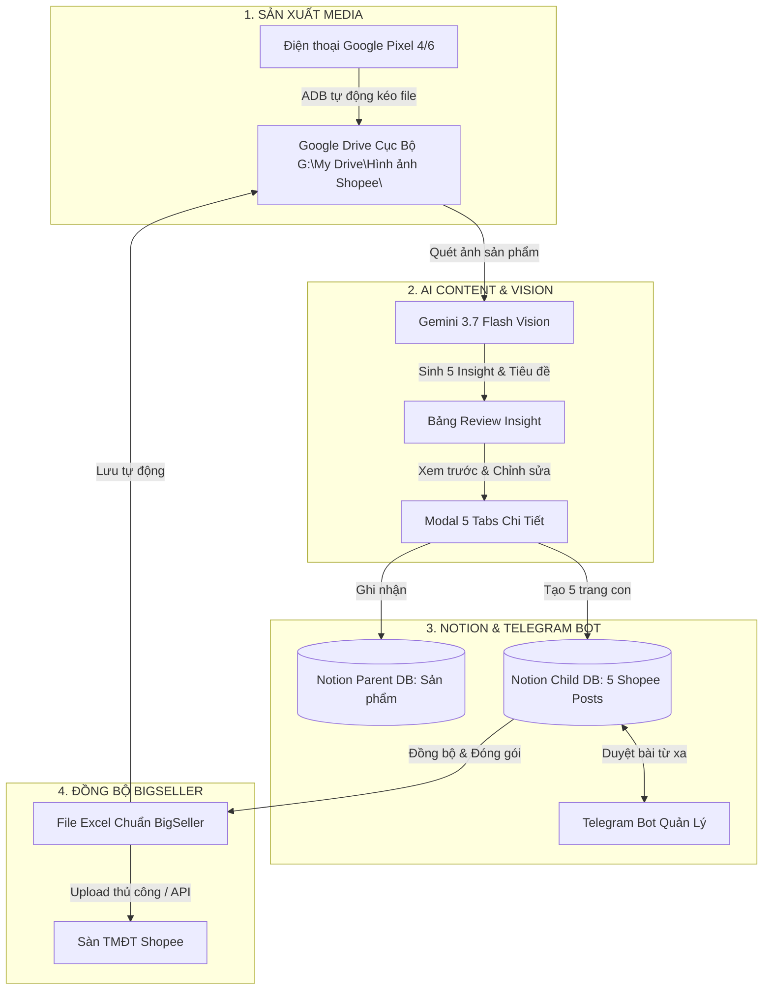
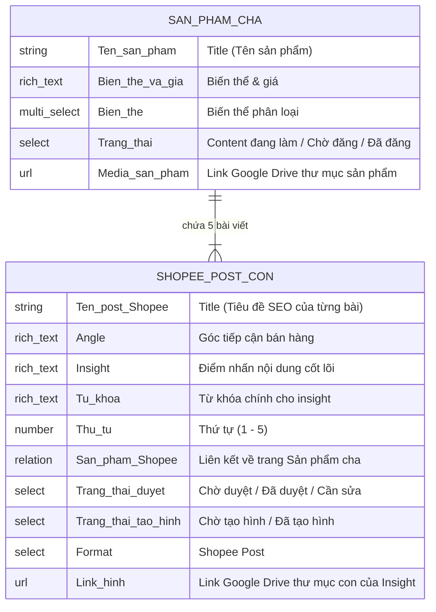

# TÀI LIỆU BÀN GIAO TOÀN DIỆN DỰ ÁN MCP SHOPEE KHẢI HOÀN (HANDOFF DOCUMENT)

> **Dành cho Codex / AI Assistant tiếp nối phát triển hệ thống**  
> **Phiên bản hiện tại:** `v2.2.46`  
> **Thư mục làm việc chính thức:** `D:\Project Anti\MCP Shopee`  
> **Repository GitHub:** `https://github.com/datdtpl-maker/MCP-Shopee_Khai-Hoan.git`  
> **Cổng Web App cục bộ:** `http://127.0.0.1:8765`

---

## 📌 1. TỔNG QUAN HỆ THỐNG & MỤC TIÊU DỰ ÁN

**MCP Shopee Khải Hoàn** là một ứng dụng Desktop & Web App toàn diện được thiết kế chuyên biệt cho hệ thống Dược Mỹ Phẩm **Khai Hoàn Skincare & Khai Hoàn Derma**. Hệ thống kết nối chuỗi quy trình bán hàng tự động khép kín:



---

## 📂 2. CẤU TRÚC THƯ MỤC & FILE CỐT LÕI

```text
D:\Project Anti\MCP Shopee\
├── web_app.py                     # [CORE] Backend Flask + Giao diện Web MD3 + Toàn bộ API Endpoints
├── pipeline.py                    # Module điều khiển ADB cho Google Pixel (Chụp/Quay/Sync ngầm)
├── config.json                    # Cấu hình cài đặt cục bộ của ứng dụng desktop
├── .env                           # File biến môi trường (Notion, Telegram, Gemini API Key)
├── handoff.md                     # Tài liệu bàn giao chi tiết cho Codex
├── .github/
│   └── workflows/
│       └── build.yml              # GitHub Actions tự động build PyInstaller khi push Tag
└── shopee_sync/
    ├── .env                       # Cấu hình env độc lập của module Shopee Sync
    ├── src/
    │   ├── notion_sync.py         # Xử lý tương tác Notion API, tạo post, xuất Excel BigSeller
    │   ├── telegram_bot.py        # Bot Telegram duyệt bài, gửi thông báo
    │   ├── convert_zicum.py       # Xử lý chuỗi, tìm kiếm folder Google Drive, ánh xạ Insight
    │   └── ai_generator.py        # Module AI bổ trợ kiểm duyệt bài viết
    └── template_excel/
        └── template_shopee.xlsx   # Mẫu file Excel chuẩn của BigSeller để clone dữ liệu
```

---

## 🗄️ 3. CẤU TRÚC DATABASE NOTION & QUAN HỆ DỮ LIỆU

Hệ thống hoạt động dựa trên mô hình **Parent - Child Relation** giữa 2 cơ sở dữ liệu Notion:



### Thông số Database ID:
* **Database Sản phẩm Cha (`NOTION_DATABASE_ID`)**: `ca055a7742824b9598abde7a7686d144`
* **Database Shopee Posts Con (`insight_database_id`)**: `88159c90-46fb-426d-b3c9-a0d79358e76c`

---

## 📁 4. CẤU TRÚC THƯ MỤC GOOGLE DRIVE CỦA SẢN PHẨM

* **Đường dẫn thư mục gốc Drive local**: `G:\My Drive\Hình ảnh Shopee\`
* **ID thư mục gốc trên Drive (`DRIVE_ROOT_FOLDER_ID`)**: `1XrOmOCqdZ3xfkeVaBc0Vr77Q7yRW0PxZ`
* **Quy tắc tổ chức thư mục cho mỗi sản phẩm**:
  ```text
  G:\My Drive\Hình ảnh Shopee\<Tên Sản Phẩm>\
  ├── Insight 1 - <Tên Angle 1>\        # Chứa ảnh/video chụp cho Insight 1
  ├── Insight 2 - <Tên Angle 2>\        # Chứa ảnh/video chụp cho Insight 2
  ├── Insight 3 - <Tên Angle 3>\        # Chứa ảnh/video chụp cho Insight 3
  ├── Insight 4 - <Tên Angle 4>\        # Chứa ảnh/video chụp cho Insight 4
  ├── Insight 5 - <Tên Angle 5>\        # Chứa ảnh/video chụp cho Insight 5
  ├── insights_data.json                # Lưu toàn bộ thông tin 5 Insight để Tab AI Edit đọc
  └── bigseller_sync_<timestamp>.xlsx   # File Excel xuất riêng cho sản phẩm này
  ```

---

## 🧠 5. LOGIC HOẠT ĐỘNG CỦA CÁC TAB CHỨC NĂNG

### TAB 1: CHỤP & QUAY (PIXEL DRIVE CAPTURE)
* **Kết nối ADB**: Tự động nhận diện thiết bị Google Pixel qua cáp USB hoặc Wi-Fi.
* **Điều khiển từ xa**: Gửi lệnh chụp ảnh, quay video từ giao diện Web App.
* **Auto-Watcher ngầm (`media_watcher_loop`)**:
  * Tự động quét thư mục máy ảnh trên Pixel `/sdcard/DCIM/Camera`.
  * Đợi file ổn định kích thước ➔ Tự động `adb pull` về máy ➔ Copy vào thư mục Drive của sản phẩm đang chọn ➔ Xóa file trên Pixel để tránh đầy bộ nhớ.
* **Quản lý Prompt mẫu**: Cho phép thêm/sửa/xóa danh mục và prompt cho studio chụp ảnh.

---

### TAB 2: ĐỒNG BỘ SHOPEE (SHOPEE NOTION - BIGSELLER & AI CONTENT)

#### 1. Bộ nạp & kiểm tra cấu hình:
* Hỗ trợ **📂 Nhập file `.txt`**, **📋 Dán nội dung** (file `đồng bộ shopee.txt` hoặc `.env`), **📥 Xuất file `.txt`**.
* Nút **`Kiểm tra Key`**: Gọi trực tiếp Google `ListModels` API và gửi prompt test đến **Gemini 3.7 Flash**.

#### 2. Phân tích ảnh & Sinh 5 Insight (`Gemini 3.7 Flash Vision`):
* Quét ảnh chụp hoặc link Drive của sản phẩm ➔ Tự động điền Tên sản phẩm, Giá, Biến thể, Phân loại ➔ Tự động tạo 5 góc bán hàng (Angle) và tiêu đề bài viết.

#### 3. Modal Xem & Chỉnh sửa chi tiết 5 Bài viết AI (`fullPostsModal`):
* Cung cấp **5 Tab** tương ứng với 5 bài viết con.
* Người dùng có thể đọc và sửa trực tiếp:
  * **Tiêu đề Shopee (`postTitle`)**
  * **Góc tiếp cận / Angle (`angle`)**
  * **Mô tả sản phẩm chi tiết (`description`)**
  * **Thành phần nổi bật (`ingredients` - mỗi hoạt chất 1 dòng)**
  * **Công dụng hỗ trợ (`benefits` - mỗi công dụng 1 dòng)**
  * **Đối tượng sử dụng (`target_users` - bám sát tình trạng da)**
  * **Cách dùng (`usage`) & Lưu ý an toàn (`notes`)**
  * **Hashtags Shopee thực tế (`hashtags`)**
* Nút **`✨ Viết lại bài này bằng Gemini AI`** để tạo lại riêng bài đang xem.
* Bấm **`💾 Lưu thay đổi bài viết`** để lưu vào bộ nhớ client.

#### 4. Ghi nhận vào Notion (`/api/review-save`):
* Tạo hoặc cập nhật trang Cha trên Database Sản phẩm.
* Tạo 5 trang Con trên Database Insight với 100% nội dung đã xem/sửa từ Modal.
* Tự động tạo file `insights_data.json` trong thư mục Drive của sản phẩm.

#### 5. Đồng bộ sang BigSeller & Xuất Excel (`notion_sync.py`):
* Chỉ xuất đúng 5 Insight của sản phẩm được chọn (không dính sản phẩm khác, không ghi đè sản phẩm cũ).
* Tự động chuyển trạng thái sản phẩm sang **"Chờ đăng"**.
* Tự động lưu bản sao file Excel vào thư mục Drive của sản phẩm.

---

### TAB 3: AI EDIT / VIDEO (POSTER & VIDEO CREATOR)
* Tự động quét các thư mục sản phẩm trên Google Drive.
* Đọc trực tiếp dữ liệu từ file `insights_data.json` của sản phẩm đó để tạo poster, banner 1:1, ảnh bìa và video ngắn cho Shopee.

---

## 🛡️ 6. BỘ QUY TẮC PROMPT COPYWRITER SHOPEE KHẢI HOÀN

Hàm `generate_single_post_body` (trong `web_app.py`) tuân thủ nghiêm ngặt các quy tắc:
1. **Giọng văn Dược sĩ / Chuyên viên tư vấn da liễu Khai Hoàn**: Đi thẳng vào công dụng, cảm giác êm dịu, tư vấn tận tâm.
2. **Cấm câu văn máy móc rập khuôn**: Tuyệt đối không dùng cụm từ *"là giải pháp chăm sóc sức khỏe và làm đẹp vượt trội"*, *"đáp ứng nỗi đau của khách hàng ở góc bán hàng"*, *"chuẩn SEO Shopee"*.
3. **Đối tượng sử dụng chính xác**: Tuyệt đối không mặc định *"Người lớn và trẻ em 6 tuổi"*. Phân loại chính xác theo bản chất: da mụn sưng viêm, da dầu nhờn, da khô nứt nẻ, phục hồi sau treatment...
4. **Tuân thủ an toàn từ ngữ y khoa Shopee**:
   * ❌ Cấm từ khẳng định chữa bệnh: *"đặc trị", "trị mụn", "điều trị", "dứt điểm", "chữa khỏi", "thuốc"*.
   * ✅ Thay bằng từ E-commerce an toàn: *"hỗ trợ giảm mụn", "giúp làm dịu sưng đỏ", "hỗ trợ gom cồi", "chăm sóc da mụn", "giúp thông thoáng da"*.
5. **Hashtags thực tế**: Tên sản phẩm viết liền không dấu `#{ten_san_pham}`, công dụng tìm kiếm `#gelchammun #giammunviem #gomcoimun #chamsocdamun`, thương hiệu `#khaihoanskincare #khaihoanderma #myphamchinhhang` (không dùng `#ShopeeSEO`, `#DuocMyPham`).

---

## ⚙️ 7. BẢNG BIẾN MÔI TRƯỜNG CẤU HÌNH

| Tên biến | Ý nghĩa | Ví dụ giá trị |
| :--- | :--- | :--- |
| `NOTION_TOKEN` | Token bí mật kết nối Notion API | `ntn_...` hoặc `secret_...` |
| `NOTION_DATABASE_ID` | Database ID Sản phẩm Cha | `ca055a7742824b9598abde7a7686d144` |
| `TELEGRAM_BOT_TOKEN` | Token điều khiển Bot Telegram | `123456789:ABCdef...` |
| `MANAGER_CHAT_ID` | Chat ID của Quản lý nhận thông báo duyệt | `6295080195` |
| `GEMINI_API_KEY` | API Key Google Gemini (Mặc định Gemini 3.7 Flash) | `AIzaSy...` |
| `DRIVE_ROOT_FOLDER_ID` | ID thư mục gốc Drive `Hình ảnh Shopee` | `1XrOmOCqdZ3xfkeVaBc0Vr77Q7yRW0PxZ` |

---

## 🚀 8. QUY TRÌNH DEPLOY & TỰ ĐỘNG BUILD APP TRÊN GITHUB

Khi hoàn thành bất kỳ chỉnh sửa nào trên mã nguồn `D:\Project Anti\MCP Shopee`:

### Bước 1: Kiểm thử cú pháp
```powershell
python -m py_compile web_app.py
```

### Bước 2: Nâng Version
Mở file `web_app.py` và cập nhật phiên bản ở dòng 43:
```python
CURRENT_VERSION = "v2.2.47"  # Tăng số phiên bản tương ứng
```

### Bước 3: Commit và Tạo Git Tag
```powershell
git add .
git commit -m "feat(tên-tính-năng): mô tả ngắn gọn thay đổi"
git push origin main
git tag v2.2.47
git push origin v2.2.47
```

### Bước 4: Kiểm tra trạng thái Build trên GitHub Actions
* Workflow `.github/workflows/build.yml` sẽ tự động đóng gói ứng dụng qua PyInstaller thành file `MCP_Shopee_Khai_Hoan.exe` và tạo bản GitHub Release.
* Kiểm tra nhanh trạng thái build:
```powershell
gh run list --limit 3
```

---

## ⚠️ 9. NGUYÊN TẮC BẤT DI BẤT DỊCH CHO CODEX

1. **Làm việc tại thư mục chỉ định**: Mọi thao tác mã nguồn bắt buộc diễn ra tại `D:\Project Anti\MCP Shopee`.
2. **Chỉnh sửa khoanh vùng (Targeted Edits)**: `web_app.py` có dung lượng rất lớn. Luôn sử dụng lệnh thay thế khoanh vùng (`replace_file_content`), **tuyệt đối không ghi đè toàn bộ file** để bảo toàn các logic khác.
3. **Mô hình AI**: Luôn đặt **`Gemini 3.7 Flash`** làm mặc định ưu tiên số 1 (kế tiếp là `Gemini 3.6 Flash`, `Gemini 3.5 Flash`, `Gemini 2.0 Flash`).
4. **Tính nhất quán dữ liệu**: Khi xuất Excel hoặc ghi Notion, chỉ thao tác trên đúng 5 Insight của sản phẩm đang chọn, không làm ảnh hưởng đến các sản phẩm khác.

---
*Tài liệu này được lưu trữ chính thức tại `D:\Project Anti\MCP Shopee\handoff.md`.*
